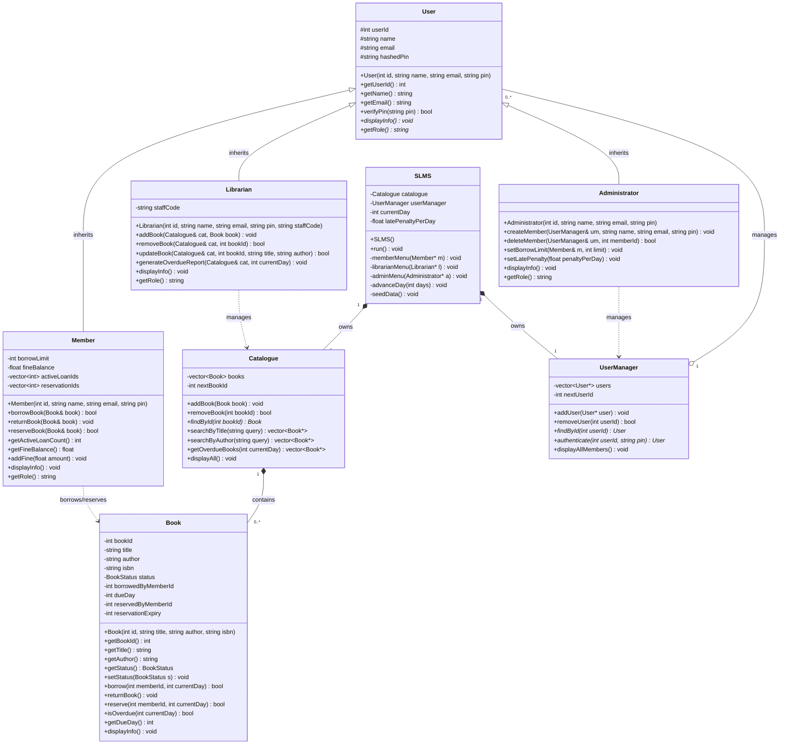

# UML Class Diagram

## Key Design Decisions

- **Inheritance hierarchy:** `User` is the abstract base class. `Member`, `Librarian`, and `Administrator` inherit from it and override `displayInfo()` and `getRole()` — demonstrating **polymorphism**.
- **Encapsulation:** All data attributes are private or protected. Access is strictly through public getter/setter methods.
- **Composition:** `SLMS` owns `Catalogue` and `UserManager`. `Catalogue` owns a collection of `Book` objects.
- **BookStatus** is an enum: `AVAILABLE`, `BORROWED`, `RESERVED`.
